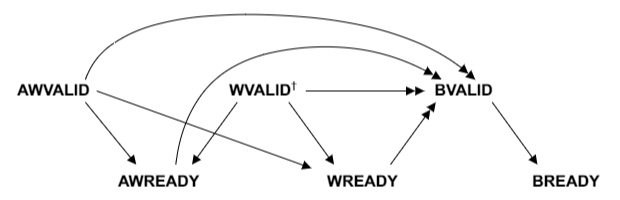

**AXI Specification**
- 

- [1. Introduction](#1-introduction)
  - [1.1. About the AXI Protocol](#11-about-the-axi-protocol)
    - [1.1.1. Features](#111-features)
    - [1.1.2. Key features](#112-key-features)
    - [1.1.3. Includes](#113-includes)
  - [1.2. AXI Architecture](#12-axi-architecture)
    - [1.2.1. Description](#121-description)
    - [1.2.2. Channel Definition](#122-channel-definition)
    - [1.2.3. Interface&Interconnect](#123-interfaceinterconnect)
    - [1.2.4. Register Slices](#124-register-slices)
  - [1.3. Terminology](#13-terminology)
    - [1.3.1. Components and Topology](#131-components-and-topology)
    - [1.3.2. Transactions](#132-transactions)
    - [1.3.3. Caches and Cache Operation](#133-caches-and-cache-operation)
    - [1.3.4. Temporal description](#134-temporal-description)
- [2. Signal Description](#2-signal-description)
  - [2.1. Global signals](#21-global-signals)
  - [2.2. Write address channel signals](#22-write-address-channel-signals)
    - [2.2.1. From Master](#221-from-master)
    - [2.2.2. From Slave](#222-from-slave)
  - [2.3. Write data channel signals](#23-write-data-channel-signals)
    - [2.3.1. From Master](#231-from-master)
    - [2.3.2. From Slave](#232-from-slave)
  - [2.4. Write response channel signals](#24-write-response-channel-signals)
    - [2.4.1. From Slave](#241-from-slave)
    - [2.4.2. From Master](#242-from-master)
  - [2.5. Read address channel signals](#25-read-address-channel-signals)
    - [2.5.1. From Master](#251-from-master)
    - [2.5.2. From Slave](#252-from-slave)
  - [2.6. Read data channel signals](#26-read-data-channel-signals)
    - [2.6.1. From Slave](#261-from-slave)
    - [2.6.2. From Master](#262-from-master)
  - [2.7. Low-power interface signals](#27-low-power-interface-signals)
- [3. Single Interface Requirements](#3-single-interface-requirements)
  - [3.1. Clock and reset](#31-clock-and-reset)
  - [3.2. Basic read and write transactions](#32-basic-read-and-write-transactions)
    - [3.2.1. Handshake process](#321-handshake-process)
    - [3.2.2. Channel signaling requirements](#322-channel-signaling-requirements)
  - [3.3. Relationships between the channels](#33-relationships-between-the-channels)
    - [3.3.1. Relationships](#331-relationships)
    - [3.3.2. Dependenci between channel handshake signals](#332-dependenci-between-channel-handshake-signals)
    - [3.3.3. Legacy considerations](#333-legacy-considerations)
  - [3.4. Transaction structure](#34-transaction-structure)
    - [3.4.1. Address structure](#341-address-structure)
    - [3.4.2. Pseudocode description of the transfers](#342-pseudocode-description-of-the-transfers)
    - [3.4.3. Data read and write structure](#343-data-read-and-write-structure)
    - [3.4.4. Read and write response structure](#344-read-and-write-response-structure)
- [4. Transaction Attributes](#4-transaction-attributes)
  - [4.1. Transaction types and attributes](#41-transaction-types-and-attributes)
  - [4.2. AXI3 memory attribute signaling](#42-axi3-memory-attribute-signaling)
    - [4.2.1. Transaction attribute encodeing](#421-transaction-attribute-encodeing)
  - [4.3. AXI4 changes to memory attribute signaling](#43-axi4-changes-to-memory-attribute-signaling)
    - [4.3.1. *AxCACHE[1], Modifiable*](#431-axcache1-modifiable)
    - [4.3.2. Updated meaning of Read-Allocate and Write-Allocate](#432-updated-meaning-of-read-allocate-and-write-allocate)
  - [4.4. Memory types](#44-memory-types)
    - [4.4.1. Memory type encoding](#441-memory-type-encoding)
    - [4.4.2. Memory type requirements](#442-memory-type-requirements)
  - [4.5. Mismatched memory attributes](#45-mismatched-memory-attributes)
    - [4.5.1. Mismatched memory attributes](#451-mismatched-memory-attributes)
    - [4.5.2. Changing memory attributes](#452-changing-memory-attributes)
  - [4.6. Transaction buffering](#46-transaction-buffering)
    - [4.6.1. Write transactions](#461-write-transactions)
    - [4.6.2. Read transactions](#462-read-transactions)
  - [4.7. Access permissions](#47-access-permissions)
    - [4.7.1. Signals](#471-signals)
    - [4.7.2. Protection attributes](#472-protection-attributes)
- [5. Transaction Identifiers](#5-transaction-identifiers)
  - [5.1. AXI transaction identifiers](#51-axi-transaction-identifiers)
  - [5.2. ID signals](#52-id-signals)
    - [5.2.1. Channel transaction ID](#521-channel-transaction-id)
    - [5.2.2. Read data ordering](#522-read-data-ordering)
    - [5.2.3. Write data ordering](#523-write-data-ordering)
    - [5.2.4. Interconnect use of transaction identifiers](#524-interconnect-use-of-transaction-identifiers)
- [6. AXI Ordering Model](#6-axi-ordering-model)
  - [6.1. AXI ordering model overview](#61-axi-ordering-model-overview)
  - [6.2. Memory locations and Peripheral regions](#62-memory-locations-and-peripheral-regions)
  - [6.3. Transactions and ordering](#63-transactions-and-ordering)
  - [6.4. Observation and completion definitions](#64-observation-and-completion-definitions)
    - [6.4.1. Observation](#641-observation)
    - [6.4.2. Completion](#642-completion)
  - [6.5. Master ordering guarantees](#65-master-ordering-guarantees)
    - [6.5.1. Guarantees before a completion response is received](#651-guarantees-before-a-completion-response-is-received)
    - [6.5.2. Guarantees from a completion response](#652-guarantees-from-a-completion-response)
    - [6.5.3. Response ordering guarantees](#653-response-ordering-guarantees)
  - [6.6. Ordering requirements](#66-ordering-requirements)
    - [6.6.1. Slave ordering requirments](#661-slave-ordering-requirments)
    - [6.6.2. Interconnect ordering requirments](#662-interconnect-ordering-requirments)
  - [6.7. Response before the endpoint](#67-response-before-the-endpoint)
    - [6.7.1. Early read response](#671-early-read-response)
    - [6.7.2. Early write response](#672-early-write-response)
  - [6.8. Ordered write observation](#68-ordered-write-observation)
    - [6.8.1. Ordered write observation](#681-ordered-write-observation)
    - [6.8.2. Ordered_Write_Observation](#682-ordered_write_observation)
- [7. Atomic Accesses](#7-atomic-accesses)
  - [7.1. Single-copy atomicity size](#71-single-copy-atomicity-size)
    - [7.1.1. Single-copy atomicity size](#711-single-copy-atomicity-size)
    - [7.1.2. Multi-copy write atomicity](#712-multi-copy-write-atomicity)
  - [7.2. Exclusive accesses](#72-exclusive-accesses)
    - [7.2.1. Exclusive access process](#721-exclusive-access-process)
    - [7.2.2. Exclusive access from the perspective of the master](#722-exclusive-access-from-the-perspective-of-the-master)
    - [7.2.3. Exclusive access from the perspective of the slave](#723-exclusive-access-from-the-perspective-of-the-slave)
    - [7.2.4. Exclusive access restrictions](#724-exclusive-access-restrictions)
    - [7.2.5. Responses to exclusive access](#725-responses-to-exclusive-access)
  - [7.3. Locked accesses](#73-locked-accesses)
  - [7.4. Atomic access signaling](#74-atomic-access-signaling)
    - [7.4.1. AXI3 Atomic access encoding](#741-axi3-atomic-access-encoding)
    - [7.4.2. AXI4 Atomic access encoding](#742-axi4-atomic-access-encoding)
    - [7.4.3. Legacy considerations](#743-legacy-considerations)
- [8. AMBA 4 Additional Signaling](#8-amba-4-additional-signaling)
  - [8.1. QoS signaling](#81-qos-signaling)
    - [8.1.1. QoS interface signals](#811-qos-interface-signals)
    - [8.1.2. Master considerations](#812-master-considerations)
    - [8.1.3. System considerations](#813-system-considerations)
  - [8.2. Multiple region signaling](#82-multiple-region-signaling)
    - [8.2.1. Additional interface signals](#821-additional-interface-signals)
  - [8.3. User-defined signaling](#83-user-defined-signaling)
    - [8.3.1. User-defined signaling configuration](#831-user-defined-signaling-configuration)
    - [8.3.2. Signaling](#832-signaling)
    - [8.3.3. Usage considerations](#833-usage-considerations)
- [9. Default Signaling and Interoperability](#9-default-signaling-and-interoperability)
  - [9.1. Interoperability principles](#91-interoperability-principles)
  - [9.2. Major interface categories](#92-major-interface-categories)
    - [9.2.1. Read/Write interface](#921-readwrite-interface)
    - [9.2.2. Read-only interface](#922-read-only-interface)
    - [9.2.3. Write-only interface](#923-write-only-interface)
    - [9.2.4. Memory slaves and Peripheral slaves](#924-memory-slaves-and-peripheral-slaves)
  - [9.3. Default signal values](#93-default-signal-values)
    - [9.3.1. Default signal values](#931-default-signal-values)
    - [9.3.2. Default signal requirements](#932-default-signal-requirements)

# 1. Introduction

## 1.1. About the AXI Protocol 

### 1.1.1. Features

- 高性能、低延迟
- 高频通信、结构简单
- 满足各种组件的接口要求
- 适用于具有较高初始访问延迟的内存控制器
- 互联架构实施高度灵活
- 兼容AHB&APB接口

### 1.1.2. Key features

- 地址/控制信息和数据单独传输
- 支持非对齐数据传输，使用写选通信号（按字节）
- 使用突发为基础的事务传输，主机仅需发出首地址
- 独立的读写数据通道，提供低开销的直接数据访问
- 支持outstanding操作，即Master不用等待上一个事务传输完成就可发送下一个事务的地址
- 支持out of order操作，即Slave返回数据时可不必按照Master发送的地址顺序
- 允许添加寄存器级以提供时序收敛

### 1.1.3. Includes

- AXI4 Lite
- AXI5 Lite
  
## 1.2. AXI Architecture

### 1.2.1. Description

- **Transaction channels**
  - Write address，写地址通道，信号以AW开头
  - Write data，写数据通道，信号以W开头
  - Write response，写回应通道，信号以B开头
  - Read address，读地址通道，信号以AR开头
  - Read data，读数据通道，信号以R开头

- **Channel architecture of transaction**
  - Channel architecture of writes 
    
  - Channel architecture of reads 
    


### 1.2.2. Channel Definition

五个独立的通道都采用VALID和READY的握手协议，此外读写数据通道还包括一个LAST信号
- **Read&Write Address Channels**  
    读写事务拥有自己的地址通道，地址通道可以携带所需的地址和控制信息
- **Read Data Channel**  
    包括数据总线（可支持8－1024位）和一个读响应信号
- **Write Data Channel**  
    1、包括数据总线（可支持8－1024位）和一个字节大小的通道选通信号（每八个数据位一个字节通道选通信号，指示数据总线的哪个字节有效）    
    2、写数据通道信息始终被视为已缓冲，因此主机可以执行写事务，而无需从机确认先前的写事务
- **Write Data Channel**  
    1、主要支持从机返回响应信号，表示传输完成
    2、每个burst传输仅需一个完成信号

### 1.2.3. Interface&Interconnect

- **Interface**  
    主机和Interconnect、从机和Interconnect以及主从机之间均需要接口

- **Interconnect Approaches**
    - **Shared address and data buses**   
        地址和数据总线均共享
    - **Shared address buses and multiple data buses**  
        地址总线共享、数据总线私有
    - **Multilayer, with mutiple address and data buses**  
        多层结构，数据和地址总线均私有

### 1.2.4. Register Slices

- 寄存器切片对AXI总线的关键路径进行切断和分割，以获得更好的时序性能

## 1.3. Terminology

### 1.3.1. Components and Topology

- Component
- Master component
- Slave component
    - Memory slave component
    - Peripheral slave component
- Interconnect component

### 1.3.2. Transactions

- Transaction
- Burst
- Beats

### 1.3.3. Caches and Cache Operation

- Cache
- Cache line

### 1.3.4. Temporal description

- The AXI specification uses the term in a timely manner.

# 2. Signal Description

## 2.1. Global signals

- **ACLK**
    Clock source

- **ARESETn**  
    Reset source   
    Active Low

## 2.2. Write address channel signals

### 2.2.1. From Master

- **AWID**  
    Write address ID，写地址ID，用来标志一组写信号
- **AWADDR**   
    Write address，写地址，突发传输首地址
- **AWLEN**   
    Burst length，突发传输的传输次数
- **AWSIZE**   
    Burst size，每次传输的字节数
- **AWBURST**   
    Burst type，加上size信息用来计算突发传输内每次传输的地址
- **AWLOCK**   
    Lock type，总线锁信号，可提供操作的原子性
- **AWCACHE**   
    Cache type，内存类型，表明一次传输是怎样通过系统的
- **AWPROT**  
    Protection type，指示事务的保护级别（正常、特权、安全）以及事务是数据访问还是指令访问
- **AWQOS**   
    写事务服务质量
- **AWREDION**   
    区域标志，能实现单一物理接口提供多个逻辑接口
- **AWUSER**   
    用户自定义信号
- **AWVALID**   
    1、Write address valid，指示写地址总线和控制信息是否有效，高电平有效  
    2、在AWREADY变高前一直保持

### 2.2.2. From Slave

- **AWREADY**   
    Write address ready，指示从机可以接收地址和控制信息，高电平有效

## 2.3. Write data channel signals

### 2.3.1. From Master

- **WID**  
    Write ID tag，写过程ID，一次写传输的ID，必须和AWID相匹配
    *AXI4中已取消*
- **WDATA**  
    Write data，可支持8-1024位数据传输
- **WSTRB**  
    Write strobes（写选通信号），指示当前传输的有效数据段,每一位对应一个字节
- **WLAST**  
    Write last，表明突发传输的最后一次传输
- **WUSER**  
    用户自定义信号
- **WVALID**  
    Write valid，指示写数据和写跳变信息有效与否，高有效

### 2.3.2. From Slave

- **WREADY**  
    Write ready，高电平时才可进行写数据

## 2.4. Write response channel signals

### 2.4.1. From Slave

- **BID**  
    Response ID，写响应ID标签，和AWID相对应
- **BRESP**  
    1、Write response，表示写事务的状态       
    2、包括4种状态：OKAY、EXOKAY、SLVERR、DECERR
- **BUSER**  
    用户自定义信号
- **BVALID**  
    Write response valid，高电平时写响应信号有效

### 2.4.2. From Master

- **BREADY**    
    Response ready，高电平时表示主机可接受响应信号

## 2.5. Read address channel signals

### 2.5.1. From Master
- **ARID**  
    Write address ID，用来标志一组读信号
- **ARADDR**  
    Write address，给出一次读突发传输的读地址
- **ARLEN**  
    Burst length，给出突发传输的次数
- **ARSIZE**  
    Burst size，给出每次传输的字节数
- **ARBURST**  
    Burst type
- **ARLOCK**  
    Lock type，总线锁信号，可提供操作的原子性
- **ARCACHE**  
    Cache type，内存类型，表明一次传输是怎样通过系统的
- **ARPROT**  
    Protection type，表明一次传输的特权级及安全等级
- **ARQOS**  
    服务质量
- **ARREGION**  
    区域标志，能实现单一物理接口对应的多个逻辑接口
- **ARUSER**  
    用户自定义信号
- **ARVALID**  
    有效信号，表明此通道的地址控制信号有效

### 2.5.2. From Slave

- **ARREADY**  
    表明Slave可以接收地址和对应的控制信号

## 2.6. Read data channel signals

### 2.6.1. From Slave

- **RID**  
    Read ID tag，一次读传输的ID
- **RDATA**  
    Read data，可支持8-1024位数据传输
- **RRESP**  
    Read response，表明读传输的状态
- **RLAST**  
    Indicating last data transfer in a read transaction
- **RUSER**  
    用户自定义信号
- **RVALID**  
    Read valid，表明此通道信号有效

### 2.6.2. From Master

- **RREADY**  
    Read ready，表明主机能够接收读数据和响应信息

## 2.7. Low-power interface signals

- **CSYSREQ**  
    1、System low-power request  
    ​2、Clock controller --> Peripheral device
- **CSYSACK**  
    1、Low-power request acknowlegement  
    2、Peripheral device --> Clock controller
- **CACTIVE**  
    1、Clock active   
    2、Peripheral device --> Clock controller

# 3. Single Interface Requirements

## 3.1. Clock and reset

- **Clock**
    - 每个AXI接口都有一个单独的时钟信号 *ACLK* 
    - 所有输入信号均在 *ACLK* 的上升沿进行采样 
    - 所有输出信号必须在 *ACLK* 上升沿之后改变 
- **Reset**
    - **特点**  
        - 低电平有效，异步复位、同步释放
    - **复位期间对个接口信号要求**  
        - 主接口信号 *ARVALID*、*AWVALID* 和 *WVALID* 必须拉低  
        - 从接口信号 *RVALID* 和 *BVALID* 必须拉低

## 3.2. Basic read and write transactions

### 3.2.1. Handshake process

- **特点**  
    - 每个通道均采用以VALID/READY为握手信号的流控机制  
    - Master和Slave都可以控制数据的传输速率  
    - VALID信号由源设备产生，READY信号由目的设备产生  
    - 当VALID和READY均为高时数据才可传输

- **示例**    
    - VALID before READY handshake 
        
    - READY before VALID handshake 
        
    - VALID with READY handshake   
           

### 3.2.2. Channel signaling requirements

- **Write address channel**  
    - 仅当地址和控制信息有效时主机才可拉高 *AWVALID*，并一直保持到从机拉高 *AWREADY*  
    - *AWREADY* 缺省值可高可低，但一般为高，否则至少需要两个时钟周期才能完成数据传输

- **Write data channel**  
    - 仅当地址和控制信息有效时主机才可拉高 *WVALID* ，并一直保持到从机 *WREADY*   
    - 仅当从机在一个周期内可接受写数据时，*WREADY* 可缺省为高  
    - 最后一次写传输时主机需要把 *WLAS* T拉高  
    - *WVALID* 为低时，写选通信号可为任意值，但一般为低或保持之前的值  
    - 无效字节一般保持为0

- **Write response channel**  
    - 仅当写响应信号有效时从机才可拉高 *BVALID*，并一直保持到主机拉高 *BREADY*  
    - 仅当主机在一个周期内可接受写响应信号时，*BREADY* 可缺省为高

- **Read address channel**  
    - 仅当地址和控制信息有效时主机才可拉高 *ARVALID*，并一直保持到从机拉高 *ARREADY*  
    - *ARREADY* 缺省值可高可低，但一般为高，否则至少需要两个时钟周期才能完成数据传输  

- **Read data channel**  
    - 仅当地址和控制信息有效时主机才可拉高 *RVALID*，并一直保持到从*RREADY*  
    - 仅当从机在一个周期内可接受写数据时，*RREADY* 可缺省为高  
    - 最后一次写传输时主机需要把 *RLAST* 拉高  
    - 无效字节一般保持为0 

## 3.3. Relationships between the channels

### 3.3.1. Relationships

- 写响应必须在写事务中的最后一次传输后
- 读数据跟随读地址
- 通道间的握手信号存在依赖关系
- Note
    - Master发出读写请求之后，必须能够提供或接收相关数据，并且在事务传输期间不依赖于来自该Master的其他事务
    - Master可以依赖从使用相同ID的事务按顺序返回的读取数据，因此，Master仅需要足够的存储空间来存储来自具有不同ID的事务的读取数据。
  
### 3.3.2. Dependenci between channel handshake signals

- **In Any Transanction**  
    - 不同AXI组件之间的VALID和READY信号没有依赖关系  
    - READY信号可以等待VALID信号置位  
- **In Read Transanction**  
      
    - 从机在拉高ARREADY之前可以等待ARVALID  
    - 从机在拉高RVALID之前必须等待ARVALID和ARREADY
- **In Write Transanction**
    - AXI3 
          
        - 主机在拉高AWVALID或WVALID之前不必等待AWREADY或WREADY
            WVALID不必等待AWREADY可以防止在从机拉高AWREADY之前等待WVALID的情况下造成死锁    
        - 从机可以在拉高AWREADY或WREADY之前等待AWVALID或WVALID  
        - 从机在拉高BVALID之前必须等待WVALID和WREADY以及WLAST
    - AXI4&AXI5     
         
        - 从机在拉高BVALID之前必须等待AWVALID、AWREADY、WVALID和WREADY以及WLAST  
        - 其他同AXI3

### 3.3.3. Legacy considerations

- AXI4&AXI5较AXI3的区别  
    Slave在接收正确的地址之前不返回给Master写响应信号

## 3.4. Transaction structure

### 3.4.1. Address structure  
    
A burst must not cross a 4KB address boundary.  

- **Burst length**  
    - **Definition**  
        - *AxLEN[3:0]* for AXI3，*AxLEN[7:0]* for AXI4 
          - *ARLEN[7:0]*，for read transfers
          - *AWLEN[7:0]*，for write transfers  
        - Burst_length = AxLEN + 1  
        
    - **Burst lengths supported**  
        1、AXI3对所有突发类型均支持1-16次传输长度  
        2、AXI4对INCR类型支持1-256次传输长度，对其他类型仅支持1-16次传输长度

    - **Rules**  
        1、对于WRAP类型，长度必须是2、4、8或16  
        2、一次Burst传输不能跨越4KB边界  
        3、不支持提前终止Burst传输
        - 可以通过禁止进一步的写操作或者忽略后续数据 来达到减少传输次数，但是在此情况下仍然需要完成后续的传输。
        - 访问一些对读操作敏感的设备如FIFO等，忽略后续数据会造成数据丢失
        - 可将长Burst打成多个短Burst
        - 
- **Burst size**
    - **Definition**  
        1、*AxSIZE[2:0]*，表示在Burst传输中，一次传输可支持的最大字节数  
        2、*ARSIZE[2:0]*，for read transfers  
        3、*AWSIZE[2:0]*，for write transfers

    - **Encoding**  
        | AxSIZE[2:0] | Bytes in transfer |
        |-|-|
        |000|**1**|
        |001|**2**|
        |010|**4**|
        |011|**8**|
        |100|**16**|
        |101|**32**|
        |110|**64**|
        |111|**128**|
    - ***Burst大小不能超过数据总线宽度*** 

- **Burst type**
    - **Types**  
        ***FIXED***  
        传输过程中地址固定，用于FIFO访问 

        ***INCR***  
        增量突发，传输过程中，地址递增，增加量取决于AxSIZE的值 

        ***WRAP***    
        1、回环突发，和增量突发类似，但会在特定高地址的边界处回到低地址处。回环突发的长度只能是2,4,8,16次传输，传输首地址和每次传输的大小对齐。最低的地址与整个传输的数据大小对齐。回环边界等于（AxSIZE*AxLEN）  
        2、用于访问Cache line

    - **Definition**
        1、*AWBURST[1:0]*，for write tranfers  
        2、*ARBURST[1:0]*，for read tranfers  
        3、Encoding  
        | AxBURST[1:0] | Burst type |
        |-|-|
        |000|*FIXED*|
        |001|*INCR*|
        |010|*WRAP*|
        |011|*Reserved*|

- **Burst address**
    - **Variables**  
        - $Start\_Address$  
        首地址  
        - $Number\_Bytes$  
        每次传输可以支持的最大字节数  
        - $Data\_Bus\_Bytes$  
        在数据总线中的字节通道数  
        - $Aligned\_Address$  
        首地址的对其形式  
        - $Burst\_Length$  
        在一个Burst传输中总传输次数  
        - $Address\_N$  
        在一个Burst传输中第N次传输的地址  
        - $Wrap\_Boundary$  
        在WRAP Burst中的地址下边界   
        - $Lower\_Byte\_Lane$  
        在一次传输中的最低寻址字节的字节通道  
        - $Upper\_Byte\_Lane$  
        在一次传输中的最高寻址字节的字节通道 
        - $INT(x)$  
        向下取整 

    - **Equations**
        - *Address* 
            - 首地址  
              $Start\_Adress = AxADDR$
            - 数据包字节数  
              $Number\_Bytes = 2^{AxSIZE}$
            - 传输长度
              $Burst\_Length = AxLEN + 1$
            - 对齐地址
              $Aligned\_Address = (INT(Start\_Address / Number\_Bytes)) \times Number\_Bytes$
            - 第一次传输地址
              $Address\_1 = Start\_Address$
          
            - INCR burst和地址未到达边界的WRAP burst
                - 第N次传输地址
                  $Address\_N = Aligned\_Address + (N-1) \times Number\_bytes$
            
            - WRAP burst   
                - 回环边界  
                  $Wrap\_Boundary = (INT(Start\_Address / (Number\_Bytes \times Burst\_Length))) \times (Number\_Bytes \times Burst\_Length)$   
                - 当地址递增至$Wrap\_Boundary + (Number\_Bytes \times Burst\_Length)$  
                    - 当前传输地址  
                      $Address\_N = Wrap\_Boundary$
                    - 下一传输地址
                      $Address\_ = Start\_Adress + (N-1)\times Number\_Bytes - (Number\_Bytes \times Burst\_Length)$  
        - *Byte lane*
            - For first transfer
              - 最低寻址字节通道
                - $Lower\_Byte\_Lane = Start\_Address – (INT(Start\_Address / Data\_Bus\_Bytes)) \times Data\_Bus\_Bytes$
              - 最高寻址字节通道
                - $Upper\_Byte\_Lane = Aligned\_Address + (Number\_Bytes – 1) – (INT(Start\_Address / Data\_Bus\_Bytes)) \times Data\_Bus\_Bytes$
            - For other transfers
              - 最低寻址字节通道
                - $Lower\_Byte\_Lane = Address\_N – (INT(Address\_N / Data\_Bus\_Bytes)) \times Data\_Bus\_Bytes$
              - 最高寻址字节通道
                - $Upper\_Byte\_Lane = Lower\_Byte\_Lane + Number\_Bytes - 1$
            - Data is transferred on:
              - $DATA((8 \times Upper\_Byte\_Lane) + 7: (8 \times Lower\_Byte\_Lane))$  
        - *Transaction Container*
          - $Container\_Size = Number\_Bytes \times Burst\_Length$
          - For INCR bursts
            - $Container\_Lower = Aligned\_Adress$
            - $Container\_Upper = Aligned\_Adress + Container\_Size$
          - For WRAP bursts
            - $Container\_Lower = Wrap\_Boundary$
            - $Container\_Upper = Wrap\_Boundary + Container\_Size$

### 3.4.2. Pseudocode description of the transfers

```text
//DataTransfer()
//=============

DataTransfer(Start_Address, Number_Bytes, Burst_Length, Data_Bus_Bytes, Mode, IsWrite)
// Data_Bus_Bytes is the number of 8-bit byte lanes in the bus
// Mode is the AXI transfer mode
// IsWrite is TRUE for a write, and FALSE for a read

assert Mode IN {FIXED, WRAP, INCR};   
addr = Start_Address;     // Variable for current address    
Aligned_Address = (INT(addr/Number_Bytes) * Number_Bytes);    
aligned = (Aligned_Address == addr);    // Check whether addr is aligned to nbytes   
dtsize = Number_Bytes * Burst_Length;   // Maximum total data transaction size 

if mode == WRAP then        
    Lower_Wrap_Boundary = (INT(addr/dtsize) * dtsize);        
    // addr must be aligned for a wrapping burst        
    Upper_Wrap_Boundary = Lower_Wrap_Boundary + dtsize;    
for n = 1 to Burst_Length        
    Lower_Byte_Lane = addr - (INT(addr/Data_Bus_Bytes)) * Data_Bus_Bytes;        
    if aligned then            
        Upper_Byte_Lane = Lower_Byte_Lane + Number_Bytes - 1        
    else            
        Upper_Byte_Lane = Aligned_Address + Number_Bytes - 1 - (INT(addr/Data_Bus_Bytes)) * Data_Bus_Bytes;         
        
    // Peform data transfer        
    if IsWrite then            
        dwrite(addr, low_byte, high_byte);
    else            
        dread(addr, low_byte, high_byte);        
        
    // Increment address if necessary        
    if mode != FIXED then            
        if aligned then
            addr = addr + Number_Bytes;                
            if mode == WRAP then                    
                //WRAP mode is always aligned                    
                if addr >= Upper_Wrap_Boundary then 
                    addr = Lower_Wrap_Boundary;           
        else                
            addr = Aligned_Address + Number_Bytes;                
            aligned = TRUE;            // All transfers after the first are aligned    
return;


```

### 3.4.3. Data read and write structure

- **Write strobes**
  - *WSTRB[n]* 对应WDATA[(8n)+7:(8n)],每一位选通信号对应8位数据位，即1个字节
  - *WSTRB[n]* 为高表示WDATA[(8n)+7:(8n)]包含的数据有效，且仅当对应数据位中的数据有效时主机才能拉高WSTRB
  - WVALID为低时，WSTRB可以是任意值

- **Narrow transfers**
  - Burst Size小于总线位宽时即发生窄传输，进行窄传输时需要选择数据传输的字节通道(Byte Lane)
    - 对于增量和回环突发传输，每一次传输所用到的字节通道不尽相同
    - 对于固定突发传输，每一次传输用到的字节通道是一样的
  - 示例
    - 8-bit transfers on 32-bit bus  
        
    - 32-bit transfers on 64-bit bus 
        

- **Byte invariance**
  - 即字节所在的位置与大小端定义无关。完全按照其地址所对应的偏移来决定其采用哪一个字节通道(byte lane)来传输，换句话说，在AXI中，认为所有的传输都是以byte为单位的，每次传输都是传了多少个byte
  - 字节不变性保证了大小端数据存储在同一个Memory中不会会互相影响

- **Unaligned transfers**
  - 使用低位地址线表示未对齐的起始地址。
  - **提供一个对齐的地址，并使用字节通道选通信号指示未对齐的起始地址。**

### 3.4.4. Read and write response structure

- **Response signals**
  - **读事务**
    - *RRSEP[1:0]*
    - 通过读数据通道返回给Master
  - **写事务**
    - *BRESP[1:0]*
    - 通过写响应通道返回给Master
  - **xRESP Encoding**
    | xRESP[1:0] | Response |
    |--|--|
    |00|*OKAY*|
    |01|*EXOKAY*|
    |10|*SLVERR*|
    |11|*DECERR*|

- **Response indication**
  - ***OKAY, normal access success***
    - 普通访问成功
    - 独占访问失败
    - 对不支持独占访问的Slave进行独占访问
  - ***EXOKAY, exclusive access success***
    - 独占访问成功
  - ***SLVERR, slave error***
    - 事务传输失败
    - **Slave发生错误的情况**
      - FIFO或缓存溢出
      - 传输大小不支持
      - 对只读区域进行写操作
      - Slave响应超时
      - 访问禁用或掉电功能
  - ***DECERR, decode error***
    - Interconnect无法解码

# 4. Transaction Attributes

## 4.1. Transaction types and attributes

- **Slave**
  - **Memory slave**
  - **Periphral slave**

- **Attributes**
  - **相关信号**
    - *AWCACHE*
    - *ARCACHE*
  - **作用**
    - 控制事务传输在系统中如何进行
    - 控制系统级缓存如何处理事务

## 4.2. AXI3 memory attribute signaling

### 4.2.1. Transaction attribute encodeing

- **Encoding** 
<table>
    <tr>
        <th>AxCACHE[n]</th>
        <th>Value</th>
        <th>Transaction Attribute</th>
    </tr>
    <tr>
        <td rowspan="2">0</td>
        <td>0</td>
        <td><em>Non-bufferable</em></td>
    </tr>
    <tr>
        <td>1</td>
        <td><em>Bufferable</em></td>
    </tr>
    <tr>
        <td rowspan="2">1</td>
        <td>0</td>
        <td><em>Non-cacheable</em></td>
    </tr>
    <tr>
        <td>1</td>
        <td><em>Cacheable</em></td>
    </tr>
    <tr>
        <td rowspan="2">2</td>
        <td>0</td>
        <td><em>No Read-Allocate</em></td>
    </tr>
    <tr>
        <td>1</td>
        <td><em>Read-Allocate</em></td>
    </tr>
    <tr>
        <td rowspan="2">3</td>
        <td>0</td>
        <td><em>No Write-Allocate</em></td>
    </tr>
    <tr>
        <td>1</td>
        <td><em>Write-Allocate</em></td>
    </tr>
</table>

- ***AxCACHE***
  - *AxCACHE[0], Bufferable(B)bit*
    - 此位拉高时，该传输事务在到达目的地之前可以被Interconnect或者任何AXI组件缓存、延迟若干周期
    - 一般只用于写事务 
  - *AxCACHE[1], Cacheable(C)bit*
    - 拉高时允许对传输事务进行分配，其他相关信息由RA和WA提供
    - 最终目的地的事务属性不必与原事务属性匹配
      - 写事务可以聚合
      - 读事务可以预取数据或者一次取数据可以用于多次传输
  - *AxCACHE[2], Read-Allocate(RA)bit*
    - 读分配策略
  - *AxCACHE[3], Write-Allocate(WA)bit*
    - 写分配策略

## 4.3. AXI4 changes to memory attribute signaling

### 4.3.1. *AxCACHE[1], Modifiable*

- **Non-modifiable transactions**
  - *AxCACHE[1]* 为低表示传输事务传输特性**不可修改**
  - 传输事务不能被分割或聚合，但当突发长度大于16时可以被分割，分割后的事务仍然遵守本小节的规则
  - 以下参数不可修改
    |Parameter|Signals|
    |--|--|
    |Transfer Address|*AxADDR、AxREGION*|
    |Burst size|*AxSIZE*|
    |Burst length|*AxLEN*|
    |Burst type|*AxBURST*|
    |Lock type|*AxLOCK*|
    |Protection type|*AxPORT*|
  - *AxCACHE* 仅可修改Bufferable位使其属性从Bufferable变为Non-bufferable
  - 事务ID和QoS值可以修改
  - **注意**
    当Burst size大于数据总线位宽时，事务可不遵循上述规则

- **Modifiable transactions**
  - *AxCACHE[1]* 为高表示传输事务传输特性**可修改**
  - 传输事务可以分割或聚合
  - 读传输事务中，可以预取相邻地址上的读数据，目的地址可以返回比主机需求更多的数据
  - 写传输事务中，可以访问比需求地址跨度更大的区域，其中使用 *WSTRB* 信号防止更新无关地址
  - 可修改的参数
    - **Transfer address**
    - **Burst size**
    - **Burst length**
    - **Burst type**
    - **Transaction ID**
    - **QoS value**
  - 不可修改的参数
    - **Lock type**
    - **Protection Type**
  - **内存属性也可修改**，只是保证其他组件对事务的可见性不被降低，例如阻止事务传输到指定的位置或更改在缓存中查找事务的需求。另外对同一地址范围内的所有事务，对内存属性的任何更改必须保持一致
  - **注意：两种情况下，事务属性不可修改**
    - 修改地址后若超过KB边界
    - 导致对单拷贝原子大小区域的单次访问被作为多次访问执行

### 4.3.2. Updated meaning of Read-Allocate and Write-Allocate

- **Redefining**
  - **读传输事务**
    - *WA*位拉高表示当前地址的数据因为写传输事务或者其他主机的传输已经缓存在Cache中
  - **写传输事务**
    - *RA*位拉高表示当前地址的数据因为读传输事务或者其他主机的传输已经缓存在Cache中

- **Cache Allocate**
  - *AWCACHE bit allocations* 
    
  - *ARCACHE bit allocations* 
    

## 4.4. Memory types

### 4.4.1. Memory type encoding

<table>
    <tr>
        <th>ARCACHE[3:0]</th>
        <th>AWCACHE[3:0]</th>
        <th>Memory type</th>
    </tr>
    <tr>
        <td>0b0000</td>
        <td>0b0000</td>
        <td><em>Device Non-bufferable</em></td>
    </tr>
    <tr>
        <td>0b0001</td>
        <td>0b0001</td>
        <td><em>Device Bufferable</em></td>
    </tr>
    <tr>
        <td>0b0010</td>
        <td>0b0010</td>
        <td><em>Normal Non-cacheable Non-bufferable</em></td>
    </tr>
    <tr>
        <td>0b0011</td>
        <td>0b0011</td>
        <td><em>Normal Non-cacheable Bufferable</em></td>
    </tr>
    <tr>
        <td>0b1010</td>
        <td>0b0110</td>
        <td><em>Write-Through No-Allocate</em></td>
    </tr>
    <tr>
        <td>0b1110(0b0110)</td>
        <td>0b0110</td>
        <td><em>Write-Through Read-Allocate</em></td>
    </tr>
    <tr>
        <td>0b1010</td>
        <td>0b1110(0b1010)</td>
        <td><em>Write-Through Write-Allocate</em></td>
    </tr>
    <tr>
        <td>0b1110</td>
        <td>0b1110</td>
        <td><em>Write-Through Read and Write-Allocate</em></td>
    </tr>
    <tr>
        <td>0b1011</td>
        <td>0b0111</td>
        <td><em>Write-Back No-Allocate</em></td>
    </tr>
    <tr>
        <td>0b1111(0b0111)</td>
        <td>0b0111</td>
        <td><em>Write-Back Read-Allocate</em></td>
    </tr>
    <tr>
        <td>0b1011</td>
        <td>0b1111(0b1011)</td>
        <td><em>Write-Back Write-Allocate</em></td>
    </tr>
    <tr>
        <td>0b1111</td>
        <td>0b1111</td>
        <td><em>Write-Back Read and Write-Allocate</em></td>
    </tr>
</table>
 
- **表中未出现的值均保留**

### 4.4.2. Memory type requirements

- **Device访问**
  - 在访问 Device 时，*AxCACHE[3:1] = 3'b000*,传输事务在中间节点不能被修改。具体地说，不能预读数据（Prefetch read）和汇聚写数据（Merge write）。这是因为在访问非存储外设时，读写的是寄存器值，预取数据是没有必要的。而将不同的写事务聚集则容易造成预期之外的问题，比如会导致相邻寄存器操作的先后顺序无法满足。
  - 根据 *AxCACHE[0]* 决定 Device 访问是否可以被中间节点缓存，决定*bufferable*性质。
    - **Non-bufferable**，*AxCACHE[0] = 0*，不可以被中间节点缓存
    - **Bufferable**，*AxCACHE[0] = 1*，可以被中间节点缓存

- **Normal Non-cacheable访问**
  - Normal 访问指正常地访问存储介质，而不会查找缓存，*AxCACHE[3:1] = 3'b001*。Normal 非缓存访问中，中间组件可以对传输事务信息进行修改，支持写事务聚合。
  - 根据*AxCACHE[0]* 决定 normal 访问是否可以被中间节点缓存，决定bufferable性质。
    - **Non-bufferable**，*AxCACHE[0] = 0*，不可以被中间节点缓存
    - **Bufferable**，*AxCACHE[0] = 1*，可以被中间节点缓存

- **Write-Through访问**
  - *Write-through* 指缓存的写入策略为直写，即数据写入缓存的同时，也写入主存储中。此时*AxCache[1:0] = 2'b10*，即中间组件可以修改传输事务，实现写聚合与读预取。*AxCache[0]* 置低，每个写事务最终必须写入目的地址。
  - 此类访问启用缓存，读数据可以来自缓存，并且每次读写操作都需要查找缓存，寻找匹配表项。
  - 根据*AxCache[3:2]* 不同，从图中得到共有 4 种情况，分别代表不同的分派提示。不过这都只是代表处理器从性能出发给出的建议，由缓存控制器视情况执行。
    - **No-Allocate**，*ARCACHE[3:2] = 2'b10*、*AWCACHE[3:2] = 2'b01*，代表建议不要为该事务分派缓存空间。
    - **Read-Allocate**，*ARCACHE[3:2] = 2'bx1*、*AWCACHE[3:2] = 2'b01*，代表建议为读事务分派缓存，但不建议为写事务分派缓存。
    - **Write-Allocate**，*ARCACHE[3:2] = 2'b10*、*AWCACHE[3:2] = 2'b1x*，代表建议为写事务分派缓存，但不建议为读事务分派缓存。
    - **Read and Write-Allocate**，*ARCACHE[3:2] = 2'b11*、*AWCACHE[3:2] = 2'b11*，代表建议为读写事务均分派缓存。

- **Write-Back访问**
  - *Write-Back* 指缓存的写入策略为写回，数据仅写入缓存，修改的缓存只在被替换时写入主存储。
  - *AxCache[1:0] = 2'b11*，即中间组件可以修改传输事务，并且进行缓存。
  - 与 Wirte-through 访问相比，区别在于由于写回策略中并不是每次写事务后都需要更新主缓存，因此无需将每个写事务传输至其本来的目的地（即主存储）。
  - 和*Write-Through* 相同，根据*AxCache[3:2]* 不同，从图中得到共有 4 种情况，分别代表不同的分派提示。不过这都只是代表处理器从性能出发给出的建议，由缓存控制器视情况执行。
    - **No-Allocate**，*ARCACHE[3:2] = 2'b10*、*AWCACHE[3:2] = 2'b01*，代表建议不要为该事务分派缓存空间。
    - **Read-Allocate**，*ARCACHE[3:2] = 2'bx1*、*AWCACHE[3:2] = 2'b01*，代表建议为读事务分派缓存，但不建议为写事务分派缓存。
    - **Write-Allocate**，*ARCACHE[3:2] = 2'b10*、*AWCACHE[3:2] = 2'b1x*，代表建议为写事务分派缓存，但不建议为读事务分派缓存。
    - **Read and Write-Allocate**，*ARCACHE[3:2] = 2'b11*、*AWCACHE[3:2] = 2'b11*，代表建议为读写事务均分派缓存。
 
## 4.5. Mismatched memory attributes

### 4.5.1. Mismatched memory attributes

- 所谓**内存属性不匹配**指的是多个Master可采用不同的内存属性去访问同一内存区域。但必须遵循以下准则：
  - 所有访问同一内存区域的的Master需要考虑任何层次内存区域的缓存一致性问题:
    - 访问**不可缓存**地址区域：所有传输事务的AxCACHE[3:2]必须为2'b00;
    - 访问**可缓存**地址区域：所有传输事务的AxCACHE[3:2]必须**不**为2'b00。
- 不同的Master可以采用不同的**缓存分派策略**
- 访问具有**正常不缓存**属性的寻址区域时，可采用**Device**访问，即可把此块存储区域视为外设
- 如果寻址区域具有Bufferable属性，则任何Master都可以使用不允许进行缓冲行为的事务来访问

### 4.5.2. Changing memory attributes

- 一些特殊的内存区域可以修改内存属性，比如从**直写**改为**写回**。
- 执行更改时需要合理的流程：
  - 所有主机停止访问该内存区域
  - 单个主机执行缓存维护操作
  - 所有主机采用新的属性重新访问

## 4.6. Transaction buffering

### 4.6.1. Write transactions

- 对以下内存类型，写事务具有相同的要求：即事务的响应可以来自中间节点，而非目的地；另外写事务必须对目的地及时可见（写事务必须最终到达目的地，而不能一直缓存在Buffer中）。
  - **Device Bufferable**
  - **Normal Non-cacheable Bufferable**
  - **Write-Through**

- 可以保存和合并写事务的**中间缓冲区**必须确保事务不会无限期地保留在其缓冲区中。 例如，合并写事务不得重置确定何时将写事务传输到最终目的地的机制。

### 4.6.2. Read transactions

- 对于不同的内存类型，读事务具有不同的要求：
  - **Device Bufferable：** 读数据必须从目的地获取
  - **Normal Non-cacheable Bufferable：** 读数据要么从目的地获取，要么从目的地相同的写事务中获取。从写事务获取读数据时必须保证写事务是最新版本，同时由此得来的数据不能被缓存
  - **Write-Through：** 读数据可以从中间的Cache中获得

- 可以响应事务的**中间缓冲区**必须确保对*Normal Non-cacheable Bufferable* 内存的任何读事务最终都将到达其目的地。这就意味着中间缓冲区对事务的缓冲不可能一直持续下去。该协议未定义任何机制来确定用于转发读取事务的数据可以保留多长时间。但是，在这种机制下，读取数据的行为一定不能重置数据超时时间。

## 4.7. Access permissions

### 4.7.1. Signals

- **AxPORT**
    为了阻止恶意程序越权访问的关键外设，AXI 协议设计了访问权限控制信号 AxPROT，配合其他安全机制，限定不同应用的访问权限。
  - ARPORT[2:0]，定义了读事务的访问权限
  - AWPORT[2:0]，定义了写事务的访问权限

- **Protection encoding**
<table>
    <tr>
        <th>AxPORT[n]</th>
        <th>Value</th>
        <th>Function</th>
    </tr>
    <tr>
        <td rowspan = '2'>0</td>
        <td>0</td>
        <td><em>Unprivileged access</em></td>
    </tr>
    <tr>
        <td>1</td>
        <td><em>Privileged access</em></td>
    </tr>
    <tr>
        <td rowspan = "2">1</td>
        <td>0</td>
        <td><em>Secure access</em></td>
    </tr>
    <tr>
        <td>1</td>
        <td><em>Non-secure access</em></td>
    </tr>
    <tr>
        <td rowspan = "2">2</td>
        <td>0</td>
        <td><em>Data access</em></td>
    </tr>
    <tr>
        <td>1</td>
        <td><em>Instruction access</em></td>
    </tr>
</table> 

### 4.7.2. Protection attributes

- **Unprivileged access**
- **Privileged access**
- **Secure access**
- **Non-secure access**
- **Data access**
- **Instruction access**

# 5. Transaction Identifiers

## 5.1. AXI transaction identifiers

- **Identifiers**
  - AXI提供事务标识符（ID）来标识必须按顺序返回给Master的单个事务。
  - 具有给定ID的所有事务必须按照特定的顺序进行传输，具有不同ID的事务则没有顺序上的限制。
  - 一个物理接口可以被多个逻辑接口复用，从而实现事务的乱序传输。但对于每个逻辑接口而言，事务的传输必须按照特定的顺序。
- **注意**
  - AXI协议并未要求必须使用ID。Master和Slave可以按照事务发出的顺序一次只处理一个事务。
  - Slave在作出响应时须在信号*BID* 或*RID*上要包含标志发出事务的Master的ID信息

## 5.2. ID signals

### 5.2.1. Channel transaction ID
<table>
    <tr>
        <th>Transaction channel</th>
        <th>Transaction ID</th>
    </tr>
    <tr>
        <td>Write address channel</td>
        <td><em>AWID</em></td>
    </tr>
    <tr>
        <td>Write data channel(AXI3 only)</td>
        <td><em>WID</em></td>
    </tr>
    <tr>
        <td>Write response channel</td>
        <td><em>BID</em></td>
    </tr>
    <tr>
        <td>Read address channel</td>
        <td><em>ARID</em></td>
    </tr>
    <tr>
        <td>Read data channel</td>
        <td><em>RID</em></td>
    </tr>
</table>

- *WID*仅在AXI3中支持，此时写地址和写数据通道的顺序是任意的。但是在AXI4中*WID*被取消，写数据通道只能紧接着写地址通道，因此就不存在*数据超前于地址*的传输，此种情况下，写地址和写数据通道的传输顺序是一致的。

### 5.2.2. Read data ordering

- Slave返回数据时必须确保RID值与响应的地址的ARID值相匹配
- 在具有不同目的Slave但是具有相同ARID值的读事务序列传输中，Interconnect必须确保主机是按照发送地址的顺序来获取读数据的
- 数据重排序
  - 读取数据的重排序深度取决于Slave中重排序缓存区的大小。
  - 按顺序处理所有事务的Slave的重排序深度为1。
  - 重排序深度相当于Slave的一个属性，是个静态值，由设计者指定。

### 5.2.3. Write data ordering

- Master发送数据的顺序必须和发送地址的顺序是一致的。
- Interconnect可以合并来自于不同Master的写传输事务，但是数据的传输必须遵循地址顺序。
- 在AXI3中就已经允许**写数据重排序**，但是在AXI4中并不建议使用写数据重排序。

### 5.2.4. Interconnect use of transaction identifiers

- 当Master和Interconnect相连时，Interconnect会向该主机端口的唯一标识符AWID、WID、ARID添加附加信息：
  - Master不必知道其他Master使用哪些ID值，因为Interconnect通过将主机号附加到原始标识符上，使每个Master使用的ID值唯一。
  - 从接口的ID标识符比主接口的ID标识符宽。
- 对于读数据，Interconnect使用RID标识符的附加位来确定读数据的目标主机端口。在将RID值传递到正确的主端口之前，Interconnect模块会删除RID标识符的附加位。
- 对于写响应，Interconnect使用BID标识符的附加位来确定写响应的目标主机端口。在将BID值传递到正确的主端口之前，Interconnect模块会删除BID标识符的附加位。

# 6. AXI Ordering Model

## 6.1. AXI ordering model overview

- AXI排序模型是基于事务标识符实现的，事务标识符通过*AWID*和ARID*发出。
- 同一通道上具有相同ID和目的地的事务请求要保持发出的顺序。
- 具有相同ID的事务响应要按照Master发出的顺序返回。
- 以下情况没有顺序限制：
  - 事务来自不同的Master
  - 读写事务之间
  - 具有不同ID的事务
  - 事务到达不同外设区域
  - 事务到达不同内存单元
- 如果Master要求无顺序保证的事务按顺序执行，则其必须等待接收上一个事务的响应后才能发出下一个事务。

## 6.2. Memory locations and Peripheral regions

- AMBA的地址映射包括存储单元和外设区域：
  - **内存单元**：
    - 从内存单元读取一个字节时返回的是该字节位置的最新值
    - 向内存单元写入一个字节会将该位置的值更新为一个新值，该值是通过对该位置的后续读取获得的
    - 对任何内存单元的读写操作都不会影响其他单元
    - 内存单元的每个位置都提供“观察保证”
    - 内存单元的大小等于该组件的单拷贝原子性大小。
  - **外设区域**：
    - 从外设区域中读取数据时并不一定返回该位置的最新值
    - 向外设区域中写入数据时不一定会将该地址上的值更新为通过后续读取获得的新值
    - 访问外设区域中的地址可能会对该区域的其他地址造成影响
    - 每块外设区域都为外设提供了“观察保证”
    - 外设区域的大小是在设计外设时定义的，但无论设计多大它都代表一个从组件

## 6.3. Transactions and ordering

- 所谓事务就是对一个或多个地址的读写，访问的地址由*AxADDR*和相关的限定词决定，例如*AxPORT*中的*Non-Secure*位
  - 仅在访问相同的内存单元或外设区域之间提供排序保证
  - 外设区域的事务传输必须完全包含在该区域之内
  - 目的节点囊括多个内存单元的事务具有多个顺序保证

- 事务可以分为*Device*访问和*Normal*访问
  - *Device*
    - *AxCACHE[1] = 0*
    - 设备事务可以用来访问外设区域或内存单元
  - *Normal*
    - *AxCACHE[1] = 1*
    - 普通事务可以用来访问内存单元，不希望用于访问外设区域
    - 普通事务访问外设区域必须以符合协议的方式完成，但是具体结果还是要在设计Slave时实现

- 写事务可以分为*Bufferable*和*Non-Bufferable*
  - 写事务类型为*Bufferable*时，可以在到达目的节点之前返回事务响应
  - *Buffeable：AxCACHE[0] = 1*; *Non-Bufferable：AXCACHE[0] = 0*
 
## 6.4. Observation and completion definitions

### 6.4.1. Observation

- **外设区域**
  - 对于外设区域的访问，读写早到的设备读写事务DRW1受到晚到的设备设备读写事务DRW2的观察

- **内存单元**
  - 写事务W1对在其之后生效的写事务W2可见
  - 读事务R1从写事务W3获取数据，而写事务W2发生在W3之后，则R1对W2可见
  - 如果读事务R2从写事务W1或W3获取数据，且W3在W1之后，则W1对R2可见
  - 读写事务类型可以是*Device*或*Normal*

### 6.4.2. Completion

- **Write completion response**
  - 当*BVALID*和*BREADY*有效时，给出关联的*BRESP*握手信号的周期即标志着写事务的完成
- **Read conpletion response**
  - 当*RVALID*、*RLAST*和*RREADY*有效时，给出最后关联的*RDATA*握手信号的周期即标志着读事务的完成

## 6.5. Master ordering guarantees

- **顺序模型保证**
  - 收到完成响应之前的可见性保证
  - 来源于完成响应的可见性保证
  - 响应顺序保证

### 6.5.1. Guarantees before a completion response is received

- 下面所述**顺序保证**的情况均是来源于同一Master，使用相同ID：
  - 访问同一外设区域的两个设备写事务DW1和DW2，DW1先于DW2发出，则顺序模型保证DW1是先于DW2到达指定区域
  - 设备读事务同设备写事务
  - 访问同一内存单元的两写事务，前一事务对后一事务可见
  - 写事务W1对读事务R2可见，W1仍然对在R2之后发出且与R2访问同一内存单元的读事务可见
- 上述保证意味着访问同一内存单元的设备访问和普通访问之间存在顺序保证

### 6.5.2. Guarantees from a completion response

- 完成响应保证以下条件：
  - 对读请求的完成响应保证了对来自任何Master的后续读取或写入请求均可见。
  - 对写请求的完成响应保证了对来自任何Master的后续读取或写入请求均可见。这种可见性是多拷贝原子系统的要求。
- 包含符合ARM架构体系的处理器的系统必须是具有多拷贝原子性。
- 可缓冲写事务的响应可以由中间节点发出。它不能保证在目的节点上已完成写入，但是对之后的事务可见。

### 6.5.3. Response ordering guarantees

- 事务响应遵循以下顺序：
  - 由同一Master发出并且具有相同ID的两个读事务，读响应的返回顺序与读请求的发出顺序一致。
  - 由同一Master发出并且具有相同ID的两个写事务，写响应的返回顺序与写请求的发出顺序一致。

## 6.6. Ordering requirements

### 6.6.1. Slave ordering requirments

- **外设区域**
  - 访问外设区域的事务的执行顺序在设计外设时确定。
  - 一般上述的执行顺序是与事务到来的顺序匹配的。

- **内存单元**
  - 访问同一内存单元并且具有相同事务ID的写事务，Slave按照接收的顺序进行处理。
  - 访问同一内存单元的写事务，Slave在接收事务W2之前就已经给出事务W1的响应时，W1的顺序必须排在W2之前。
  - 访问同一内存单元的读写事务W1和R2，Slave在给出W1的响应之后接收R2，则W1必须排在R2之前。
  - 访问同一内存单元的读写事务R1和W2，Slave在给出R1的响应之后接收W2，则R1必须排在W2之前。

- **响应顺序**
  - 具有相同事务ID的读写事务，返回响应的顺序按照接收的顺序
 
### 6.6.2. Interconnect ordering requirments

- **互联组件的属性**
  - 在一个端口上接收到请求，该请求在另一个端口上被发出或被响应。
  - 在一个端口上接收到响应，该响应在另一个端口上被发出或被使用。

- **互连发出请求或响应时，遵循以下条件**
  - 访问同一或者具有重叠的内存单元并且具有相同事务ID的读写事务，请求的发出顺序同接收顺序。
  - 访问同一外设区域且具有相同事务ID的读写事务，请求的发出顺序同接收顺序。
  - 具有相同事务ID的读写事务，请求的发出顺序同接收顺序。
- **注意**
  - 当互连表现为一个从组件时，此时遵循Slave的顺序要求。
  - 任何关于事务ID值的操作都必须确保维持原始ID值的顺序要求。

## 6.7. Response before the endpoint

- **Early response**
  - 为了提高系统性能，一些事务可以由中间组件响应，这种行为被称为*Early response*。这种情况下中间组件必须保证事务的可见性和保序性。

### 6.7.1. Early read response

- 对于普通读事务，如果中间组件的本地内存中的数据相对于之前对相同或重叠地址的写入是最新的，则该中间组件可以用本地内存中的数据进行响应。
- 中间组件按必须遵循ID排序规则，具有相同ID的事务返回响应时，必须按照接收时的顺序。

### 6.7.2. Early write response

- 对于可缓冲写事务，对下游没有观察者的事务，中间组件可以发送*Early write response*。这种情况下中间组件可以将数据备份到本地缓存中，但在丢弃该数据之前需要将事务传输到下游。
- 中间组件按必须遵循ID排序规则，具有相同ID的事务返回响应时，必须按照接收时的顺序。
- 发送*Early write response*之后，在事务传输到下游并收到写响应之前，中间组件要保证事务的保序性和可见性。
- 在发送*Early write response*与接收到下游的写响应期间，中间组件必须保证以下情况：
  - 如果对普通事务给出*Early write response*，则访问相同或具有重叠的内存单元的后续事务都须排在该事务之后。
  - 如果对设备事务给出*Early write response*，则访问相同外设区域的后续事务都须排在该事务之后。
- 当为可缓冲的设备事务提供*Early write response*，中间组件传播该写事务时不依赖于其他事务。中间组件在传播先前的设备写事务之前不能等待其他读写事务的到来。

## 6.8. Ordered write observation

### 6.8.1. Ordered write observation

- 为了提高支持不同排序模型的接口协议的兼容性，从接口可以为写事务提供更有力的顺序保证。 更有力的顺序保证被称为*Ordered write observation*。
- *Ordered write observation*保证来自同一Master并且具有相同ID的事务，前一事务对后一事务可见。
- 使用*Producer-Consumer*顺序模型的Master与具有*Ordered write observation*的从接口连接时，Master发送写事务时不须等待之前的事务响应。

### 6.8.2. Ordered_Write_Observation 
- *Ordered_Write_Observation*属性用来定义接口是否提供*Ordered write observation*
  - **TRUE**：提供
  - **FALSE**：不提供
  - 默认为*不提供*

# 7. Atomic Accesses

## 7.1. Single-copy atomicity size

### 7.1.1. Single-copy atomicity size

- AXI4协议引入了单拷贝原子大小的概念。该术语定义事务自动更新的最小字节数。AXI4协议要求的事务大小大于单拷贝原子性大小，必须以至少单拷贝原子性大小的块更新内存。
- 注意
  - 原子性并没有定义数据更新的确切时间。必须确保的是，没有任何Master能够观察到原子数据的部分更新形式。例如，在许多系统中，数据结构（例如链表）由32位原子元素组成。对这些元素之一进行原子更新需要同时更新整个32位值。不接受任何Master一次只观察16位的更新，然后再观察其他16位的更新是不可接受的。
- 更复杂的系统需要支持更大的原子元素，尤其是64位原子元素，以便Master可以使用基于这些更大原子元素的数据结构进行通信。
- 系统中支持的单拷贝原子性大小很重要，因为给定通信中涉及的所有组件都必须支持所需的原子元素大小。如果两个Master通过一个互连和一个Slave进行通信，则所有涉及的组件必须确保以原子性处理所需大小的事务。
- AXI4协议不要求特定的单拷贝原子性大小，并且系统可以设计为支持不同的单拷贝原子性大小。
- 不同组的组件可以具有不同的单拷贝原子性大小，以在组内进行通信。 在AXI4中，术语“单拷贝原子组”描述了可以以特定原子性进行通信的一组组件。 例如，图7-1显示了一个系统，其中：
  - 处理器，数字信号处理器（DSP），DRAM控制器，DMA控制器，外设，SRAM存储器和相关的互连位于32位单拷贝原子组中。
  - 处理器，DSP，DRAM控制器和相关的互连也位于64位单拷贝原子组中。
  
- :grey_question:事务的原子性保证永远不会大于其起始地址的对齐形式。例如，未与8字节边界对齐的64位单拷贝原子组中的突发传输没有任何64位单拷贝原子保证。
- 与事务相关的字节选通信号不影响单拷贝原子性的大小。

### 7.1.2. Multi-copy write atomicity 

- **Multi_Copy_Atomicity**
  - **True**：支持多拷贝原子性
  - **False**：不支持多拷贝原子性
  - 默认不支持

- 以下情况系统具有多拷贝原子性：
  - 所有Agents都已相同的顺序对访问相同位置的写事务。
  - 一个写事务对一个Agent可见，则对所有的Agents可见。

- 可以通过以下方式确保多拷贝原子性：
  - 对给定地址使用单个序列化点，以便对同一位置的所有访问进行排序。这必须确保该位置的所有一致性缓存副本在使该位置的新值对任何Agent可见之前都无效。
  - 避免使用任何Agent上游的转发缓冲区。这可以防止某个位置的缓冲写事务在对所有Agent可见之前对某些Agent可见。
  - 对于本发行版G和更高版本，要求Multi_Copy_Atomicity属性为True。

## 7.2. Exclusive accesses

- 独占访问机制使得信号量类型操作（semaphore type operations）的开发不需要总线在操作期间保持对某一个特定主机的锁定。
- 这意味着信号量类型的操作不会影响总线访问延迟或最大可达到的带宽。
- AxLOCK信号选择独占访问，RRESP和BRESP信号表示独占访问的成功或失败。
- Slave需要额外的逻辑来支持独占访问。AXI协议提供了一种用于指示Master何时尝试对不支持它的Slave进行独占访问的机制。本节的其余部分描述了AXI Exclusive访问机制。

### 7.2.1. Exclusive access process

- **独占访问的基本过程**
1. Master对一个地址执行独占读取。
2. 之后，Master尝试通过对同一地址执行独占写入，并使用与用于独占读取的ARID匹配的AWID来结束独占操作。
3. 此独占写入访问结果可以表示为：
   - 在读和写访问之间，如果没有其他Master对该位置进行写访问，则独占访问成功,这种情况下，地址位置被该独占写访问更新。
   - 在读和写访问之间，如果任何Master对该位置进行写访问，则独占访问失败，在这种情况下，地址位置不会被更新。

- **注意**
  - 一个主机可能还没有完成一个独占操作的写操作部分。独占访问的监视硬件，只能监视每个事务ID的一个地址。
  - 如果一个Master没有完成独占操作的写操作部分，则接下来的一个独占读访问会改变正在被独占地监视的地址。

### 7.2.2. Exclusive access from the perspective of the master

- 主机通过执行一个独占读操作来开始一个独占操作，独占操作通常从从机返回一个EXOKAY响应，表示从机记录了要被监视的地址。
- 注意
  - 如果主机尝试从一个不支持独占访问的从机执行一个独占读操作，则从机返回OKAY响应，而不是EXOKAY响应，表示独占访问失败。
  - 主机可将这种情况当做错误条件，表示不支持独占访问，推荐主机在这种情况下，不执行该独占操作的写操作部分。
- 独占读操作之后通常会对同一地址进行独占写操作：
  - 如果地址位置没有发生改变，则独占写成功，从机返回EXOKAY响应，并且更新内存位置。
  - 如果地址位置发生了改变，则独占写失败，从机返回OKAY响应，且不会更新内存位置。
- 一个主机可能无法完成独占访问的写操作部分。如果发生这种情况，则从机继续监视独占的地址，直到另一个独占读操作开始一个新的独占访问。
- 在独占访问的读操作完成之前，主机不能开始独占访问的写操作部分。

### 7.2.3. Exclusive access from the perspective of the slave

-  一个不支持独占访问的从机可以忽视 *ARLOCK[1:0]/AWLOCK[1:0]* 信号，从机必须为正常访问和独占访问提供一个OKAY响应。

- 一个支持独占访问的从机必须具有监控硬件，一般具有一个监控单元，用来监控可访问该从机的每个可独占访问的主机ID。一个单端口从机可以具有一个从机外部的标准独占访问监控器，但是多端口的从机可能需要内部监控器。

- 独占访问监控器记录任何独占读操作的地址和ARID值，之后监控器一直监控该位置，直到一个到该位置的写操作发生，或者直到相同的ARID值的另一个独占读操作将监控器复位到一个不同的地址；

- 当一个具有给定的AWID值的独占写操作发生，则监控器会检查该地址是否正在被独占监控;
  - 如果是，则表示独占写操作之前，该位置没有发生写操作，独占写操作会继续执行，来完成独占访问。从机返回EXOKAY响应到主机。
  - 如果独占写发生时，地址不再被监控，则表示以下情况：
    - 从机独占读之后，位置被更新
    - 监控器已经被复位到另一个位置
    - 主机未发出具有与独占写操作相同属性的独占读操作
    - 以上情况下，独占写操作都不能更新地址位置，并且从机必须返回OKAY响应，代替EXOKAY响应

### 7.2.4. Exclusive access restrictions

- **独占访问约束**
  - 独占访问的地址必须与事务中的字节总数对齐，即突发大小和突发长度的乘积。
  - 独占访问突发中要传输的字节数必须是2的指数次方，即1、2、4、8、16、32、64或128个字节。
  - 独占突发中可以传输的最大字节数为128。
  - 独占访问的突发长度不能超过16。
  - *AxCACHE*信号的值必须确保事务到达正在监视独占访问的从设备。如果有缓冲区或缓存区可能会在到达监视器之前响应独占访问，因此独占访问必须是不可缓冲的和不可缓存的。
  - 地址域要么是不可共享的要么是系统可共享的。
  - 事务类型必须为 *ReadNoSnoop* 或 *WriteNoSnoop*。
  - **不遵循上述约束会产生无法预料的行为。**

- 独占访问可以分为独占读操作和独占写操作，对于两次传输，下列信号必须保持一致：
  - *AxID*
  - *AxADDR*
  - *AxREGION*
  - *AxLEN*
  - *AxSIZE*
  - *AxBURST*
  - *AxLOCK*
  - *AxCACHE*
  - *AxPORT*
  - *AxDOMAIN*
  - *AxSNOOP*
  - *AxMMUSECSID*
  - *AxMMUSID*
  - *AxMMUSSIDV*
  - *AxMMUSSID*
  - *AxMMUATST*

- 独占操作期间要监视的最小字节数由事务的突发长度和突发大小定义。但从机可以监视更多的字节，最大为128，这是独占访问的最大大小。但是，这可能导致成功的独占访问被指示为失败，因为相邻字节被更新。

### 7.2.5. Responses to exclusive access

- 响应信号 *BRESP* 和 *RRESP*中包含一个用于指示正常访问成功的*OKAY* 信号，以及一个用于指示独占访问成功的 *EXOKAY* 信号。同时，*OKAY* 信号还可以指示独占访问失败。
- 注意
  - 对不支持独占访问的从属设备的独占写操作始终会更新内存位置。
  - 仅当独占写入操作成功时，对支持独占访问的从属设备进行独占写入才更新内存位置。
- 独占写入使用BRESP进行单个响应，可以是OKAY，EXOKAY，SLVERR或DECERR。
- 独占读取具有一个或多个响应节拍。这些可以是EXOKAY，SLVERR和DECERR的混合，也可以是OKAY，SLVERR和DECERR的混合。但是不允许在同一事务中混合使用EXOKAY和OKAY响应。
 
## 7.3. Locked accesses

- AXI4不支持锁定访问，但AXI3中必须支持锁定访问。
- AXI4取消锁定访问的原因：
  - 大多数组件不需要锁定的事务传输
  - 锁定的事务传输的实现会有重大影响：
    - 互连的复杂性
    - 做出QoS保证的能力

## 7.4. Atomic access signaling

### 7.4.1. AXI3 Atomic access encoding
<table>
    <tr>
        <th>AxLOCK[1:0]</th>
        <th>Access type</th>
    </tr>
    <tr>
        <td>00</td>
        <td><em>Normal access</em></td>
    </tr>
    <tr>
        <td>01</td>
        <td><em>Exclusive access</em></td>
    </tr>
    <tr>
        <td>10</td>
        <td><em>Locked access</em></td>
    </tr>
    <tr>
        <td>11</td>
        <td><em>Reserved</em></td>
    </tr>
</table>

### 7.4.2. AXI4 Atomic access encoding
<table>
    <tr>
        <th>AxLOCK</th>
        <th>Access type</th>
    </tr>
    <tr>
        <td>0</td>
        <td><em>Normal access</em></td>
    </tr>
    <tr>
        <td>1</td>
        <td><em>Exclusive access</em></td>
    </tr>
</table>

### 7.4.3. Legacy considerations
<table>
    <tr>
        <th>AXI3</th>
        <th>AXI4</th>
    </tr>
    <tr>
        <td><em>AWLOCK[1:0] = 2'b10</em></td>
        <td><em>AWLOCK = 0</em></td>
    </tr>
    <tr>
        <td><em>ARLOCK[1:0] = 2'b10</em></td>
        <td><em>ARLOCK = 0</em></td>
    </tr>
</table>

# 8. AMBA 4 Additional Signaling

## 8.1. QoS signaling

### 8.1.1. QoS interface signals

- *AxQoS*
  - *ARQoS*：4位QoS信号，每个读事务均通过读地址通道发送。
  - *AWQoS*：4位QoS信号，每个写事务均通过写地址通道发送。
- 作用
  - 该协议未指定QoS标识符的确切用法。但一般会将 *AxQOS* 用作读写事务的优先级指示符，较高的值表示事务优先级较高。缺省值 *0b0000* 表示接口未参与任何QoS方案。
- 注意
  - 也可以使用QoS的其他解释。

### 8.1.2. Master considerations

- 主机可以产生自己 *AxQOS* 值，如果主机可以发出多个事务流，则它可以给不同的事物流以不同的QoS值。
- 支持QoS代表着要对所使用的QoS方案有着系统的了解，并且所有参与的组件要相互配合协作。因此，主机一般要具有可编程性，以控制在不同场景下QoS的确切值。
- 如果主组件不支持可编程的QoS方案，则它可以使用QoS值来表示其生成的事务的相对优先级。并且在适当的情况下可以将这些值映射到替代的系统级QoS值。
- 无法产生自己的*AxQOS*值的主机必须使用默认值。
- 注意
  - 该协议书期望多数互连组件将支持可编程寄存器，用于将QoS值分配给连接的主机。这些值取代了主机提供的QoS值（已编程或默认）。

### 8.1.3. System considerations

- 如AXI4中定义的QoS信令可与任何兼容的系统级QoS方法一起使用。
- QoS的默认系统级实现是：仅当没有其他AXI约束要求以特定顺序处理事务时，首先处理QoS值高的事务。即AXI的排序规则的优先级要高于QoS。
- 可以实现与此默认方案兼容的更复杂的QoS方案。

## 8.2. Multiple region signaling

### 8.2.1. Additional interface signals

- **AxREGION信号**
  - *AWREGION*：4-bits地址区域标识符，每个写事务通过写地址通道发送。
  - *ARREGION*：4-bits地址区域标识符，每个读事务通过读地址通道发送。

- 4-bits的区域标识符最多可唯一标识16个不同的区域。区域标识符可以提供地址的高位解码。在某4KB地址空间中保持不变。
- 区域标识符的使用使得从机上的单个物理接口可以提供多个逻辑接口，每个逻辑接口在系统地址映射中具有不同的地址位置，而从机就不必支持不同逻辑接口之间的地址解码。
- 当对具有多个逻辑接口的单个从设备执行地址解码时，此协议期望互连使用*AxREGION*信号。如果从站在系统地址映射中只有一个物理接口，则互连必须使用默认的*AxREGION*值。

- **区域标识符使用模式**（不限于以下两种）
  - 外设可以将其主数据路径和控制寄存器放置在地址映射中的不同位置，并且可以通过单个接口进行访问，而无需从机执行地址解码。
  - 从机可以在不同的存储区域中表现出不同的行为。例如，从设备可能在一个区域中提供读写访问，而在另一区域中提供只读访问。

- **注意**
  - 从机必须确保正确的协议信号传递以及维持正确的事务顺序。
  - 从机必须确保以正确的顺序为ID相同但访问区域不同的两个事务提供响应。
  - 从机必须确保任何*AxREGION*值具有正确的协议信号传递。
  - 如果从机内部的地址划分区域少于16个，则在访问不受支持的区域时，从机必须确保正确的信号传递。具体如何实现由设计从机时决定，例如：
    - 为访问不受支持的区域的任何访问都提供错误响应
    - :grey_question: 在所有不受支持的区域中对受支持的区域进行别名处理，以确保对所有访问均给出符合协议的响应。
  - *AxREGION* 信号仅提供现有地址空间的地址解码，从机可以使用它来消除对地址解码功能的需求。信号不会创建新的独立地址空间。 *AxREGION* 只存在于地址解码功能下游的接口上

## 8.3. User-defined signaling

- 在AMBA 4中引入了用户定义的信号。对于AMBA 5，这些信号的用法和配置在协议中得到了进一步的阐明和统一。AXI接口可以包括一组用户定义的信号，称为用户信号。这些信号可用于将信息扩展到现有AMBA规范未涵盖的要求的事务中。扩展信息可添加到：
  - 事务请求
  - 事务响应
  - 内部的每个读写数据节拍 
- 通常，本规范建议不要使用用户信号。AXI协议未定义这些信号的功能，如果两个组件以不兼容的方式使用相同的用户信号，则可能导致互操作性问题

### 8.3.1. User-defined signaling configuration

- **User signals properties**
  - 如果属性值为零，则接口上不存在相关信号。
  - 最大值仅具有指导意义，以便为可配置接口设置合理的最大值。 
<table>
    <tr>
        <th>Name</th>
        <th>Min</th>
        <th>Max</th>
        <th>Applies to</th>
    </tr>
    <tr>
        <td><em>USER_REQ_WIDTH</em></td>
        <td>0</td>
        <td>128</td>
        <td><strong>AWUSER，ARUSER</strong></td>
    </tr>
    <tr>
        <td><em>USER_DATA_WIDTH</em></td>
        <td>0</td>
        <td>DATA_WIDTH/2</td>
        <td><strong>WUSER，RUSER</strong></td>
    </tr>
    <tr>
        <td><em>USER_RESP_WIDTH</em></td>
        <td>0</td>
        <td>16</td>
        <td><strong>BUSER，RUSER</strong></td>
    </tr>
</table>


- **以下接口类型可以包括自定义信号：**
  - ACE5
  - ACE5-Lite
  - ACE5-LiteDVM
  - ACE5-LiteACP
  - AXI5
  - AXI5-Lite

### 8.3.2. Signaling

- **User-defined signals** 
<table>
    <tr>
        <th>Signal</th>
        <th>Width</th>
        <th>Description</th>
    </tr>
    <tr>
        <td><strong>ARUSER</strong></td>
        <td><em>USER_REQ_WIDTH</em></td>
        <td>
            用户自定义读请求属性
            其有效性同其他读地址通道信号
        </td>
    </tr>
    <tr>
        <td><strong>AWUSER</strong></td>
        <td><em>USER_REQ_WIDTH</em></td>
        <td>
            用户自定义写请求属性
            其有效性同其他写地址通道信号
        </td>
    </tr>
    <tr>
        <td><strong>WUSER</strong></td>
        <td><em>USER_DATA_WIDTH</em></td>
        <td>
            用户自定义写数据属性
            其有效性同其他写数据通道信号
        </td>
    </tr>
    <tr>
        <td><strong>RUSER</strong></td>
        <td><em>USER_RESP_WIDTH＋USER_RESP_WIDTH</em></td>
        <td>
            用户自定义读数据和读响应属性
            其有效性同其他读数据通道信号
        </td>
    </tr>
    <tr>
        <td><strong>BUSER</strong></td>
        <td><em>USER_RESP_WIDTH</em></td>
        <td>
            用户自定义写响应属性
            其有效性同其他写响应通道信号
        </td>
    </tr>
</table> 

### 8.3.3. Usage considerations

- 在使用用户信号的情况下，并不需要所有通道都支持用户信号。是否包括用户信号的设计对请求，数据和响应通道是独立的。
- 为了帮助数据宽度和协议转换，本规范建议：
  - USER_DATA_WIDTH是数据总线宽度的整数倍（以字节为单位）。
  - 用户响应位对于读取或写入响应的每个节拍都是相同的值。
  - RUSER的低位用于传输每个事务的响应信息。 
  - RUSER的高位用于传输逐拍读取的数据信息。

# 9. Default Signaling and Interoperability

- 本章介绍了默认信号指令和AXI接口的互操作性。
- AXI协议不需要组件使用AXI接口上可用的全部信号集。为了帮助连接不使用每种信号的组件，本章定义了接口的主要类别以及适用于每种类别的限制。

## 9.1. Interoperability principles
  
- 下面所述互操作性原则适用于所有的AXI3和AXI4组件。
- 作为一般原则，组件必须支持所有输入组合，但不必生成所有输出组合。例如，从设备必须支持所有可能的不同长度的突发传输，而主设备仅生成其使用的突发类型。此策略可确保所有组件与其他组件一起使用。
- AXI接口可以省略信号的情形：
  - **输出可选**
    - 如果一个组件要求某信号的值不是默认值，则该组件必须输出该信号。
    - 如果一个组件对某信号的值不做要求，即为默认值，则该组件不需要输出该信号。
  - **输入可选** 
    - 当主机或从机不需要观察某输入信号就可进行正确的功能操作时，该输入信号即可省略。
- **注意**：在适当的时机，互连组件也可以省略信号
  - 当信号被驱动为其默认值时，就不需要跨互连传输该信号，可以在其目的地创建该信号。 
  - 如果在任何目的地均未使用某信号，则无需跨互连传输该信号。

## 9.2. Major interface categories

### 9.2.1. Read/Write interface

- 读写接口包含以下AXI通道：
  - 读地址
  - 读数据
  - 写地址
  - 写数据
  - 写响应

### 9.2.2. Read-only interface

- 只读接口仅支持读事务并且包含以下AXI通道：
  - 读地址
  - 读数据 
- **注意**
  - 只读接口不支持独占访问。
 
### 9.2.3. Write-only interface

- 只写接口仅支持写事务并且包含以下AXI通道：
  - 写地址
  - 写数据
  - 写响应
- **注意**
  - 只写接口不支持独占访问。

### 9.2.4. Memory slaves and Peripheral slaves

- AXI从机可分为存储从机和外设从机：
  - 存储从机必须能够正确处理所有事物类型。
  - 外设从机应具有自己定义的访问方法，该方法可用于确定访问设备的事务类型，以及是否对设备的访问方式有任何限制。
    - 通常，在组件的数据表中描述了定义的访问方法。任何不是定义的访问方法的访问都可能导致外设发生故障，但该访问应以符合协议的故障安全方式完成，以防止系统死锁。在此情况下外设并不需要继续正确的操作。
    - 由于外设仅针对其定义的访问方法才能正常工作，因此外设的接口信号集会大大减少。

- **注意**
  - 期望所有外设都支持事务的子集，该子集允许使用可以在C代码中指定的访问来控制外围设备。例如，可能支持单个8位，单个16位或单个32位对齐的事务。
  - 未定义最小子集，因为所支持事务的子集在外设之间可能有所不同。例如，一个外设可能仅支持16位访问，而另一个外设可能仅支持32位访问。

## 9.3. Default signal values

- 通常，为了最大程度地实现IP重用，AXI组件接口应包括所有信号，这样降低了在设计流程的系统集成阶段出错的风险，并且还可以支持某些不能有效支持省略信号的默认值的设计流程。

### 9.3.1. Default signal values

- **主接口写通道信号及其默认值**
<table>
    <tr align="left">
        <th>Signal</th>
        <th>Direction</th>
        <th>Required?</th>
        <th>Default</th>
    </tr>
    <tr>
        <td><strong>ACLK</strong></td>
        <td>Input</td>
        <td>Required</td>
        <td>-</td>
    </tr>
    <tr>
        <td><strong>ARESETn</strong></td>
        <td>Input</td>
        <td>Required</td>
        <td>-</td>
    </tr>
    <tr>
        <td><strong>AWID</strong></td>
        <td>Output</td>
        <td>Optional</td>
        <td>All zeros</td>
    </tr>
    <tr>
        <td><strong>AWADDR</strong></td>
        <td>Output</td>
        <td>Required</td>
        <td>-</td>
    </tr>
    <tr>
        <td><strong>AWREGION</strong></td>
        <td>Output</td>
        <td>Optional</td>
        <td>All zeros</td>
    </tr>
    <tr>
        <td><strong>AWLEN</strong></td>
        <td>Output</td>
        <td>Optional</td>
        <td>All zeros, Length 1</td>
    </tr>
    <tr>
        <td><strong>AWSIZE</strong></td>
        <td>Output</td>
        <td>Optional</td>
        <td>Data bus width</td>
    </tr>
    <tr>
        <td><strong>AWBURST</strong></td>
        <td>Output</td>
        <td>Optional</td>
        <td>0b01, INCR</td>
    </tr>
    <tr>
        <td><strong>AWLOCK</strong></td>
        <td>Output</td>
        <td>Optional</td>
        <td>All zeros, Normal access</td>
    </tr>
    <tr>
        <td><strong>AWCACHE</strong></td>
        <td>Output</td>
        <td>Optional</td>
        <td>0b0000</td>
    </tr>
    <tr>
        <td><strong>AWPROT</strong></td>
        <td>Output</td>
        <td>Required</td>
        <td>-</td>
    </tr>
    <tr>
        <td><strong>AWQOS</strong></td>
        <td>Output</td>
        <td>Optional</td>
        <td>0b0000</td>
    </tr>
    <tr>
        <td><strong>AWVALID</strong></td>
        <td>Output</td>
        <td>Required</td>
        <td>-</td>
    </tr>
    <tr>
        <td><strong>AWREADY</strong></td>
        <td>Input</td>
        <td>Required</td>
        <td>-</td>
    </tr>
    <tr>
        <td><strong>WDATA</strong></td>
        <td>Output</td>
        <td>Required</td>
        <td>-</td>
    </tr>
    <tr>
        <td><strong>WSTRB</strong></td>
        <td>Output</td>
        <td>Optional</td>
        <td>All ones</td>
    </tr>
    <tr>
        <td><strong>WLAST</strong></td>
        <td>Output</td>
        <td>Required</td>
        <td>-</td>
    </tr>
    <tr>
        <td><strong>WVALID</strong></td>
        <td>Output</td>
        <td>Required</td>
        <td>-</td>
    </tr>
    <tr>
        <td><strong>WREADY</strong></td>
        <td>Input</td>
        <td>Required</td>
        <td>-</td>
    </tr>
    <tr>
        <td><strong>BID</strong></td>
        <td>Input</td>
        <td>Optional</td>
        <td>-</td>
    </tr>
    <tr>
        <td><strong>BRESP</strong></td>
        <td>Input</td>
        <td>Optional</td>
        <td>-</td>
    </tr>
    <tr>
        <td><strong>BVALID</strong></td>
        <td>Input</td>
        <td>Required</td>
        <td>-</td>
    </tr>
    <tr>
        <td><strong>BREADY</strong></td>
        <td>Output</td>
        <td>Required</td>
        <td>-</td>
    </tr>
</table> 

- **存储从接口写通道信号及其默认值**
<table>
    <tr align="left">
        <th>Signal</th>
        <th>Direction</th>
        <th>Required?</th>
        <th>Default</th>
    </tr>
    <tr>
        <td><strong>ACLK</strong></td>
        <td>Input</td>
        <td>Required</td>
        <td>-</td>
    </tr>
    <tr>
        <td><strong>ARESETn</strong></td>
        <td>Input</td>
        <td>Required</td>
        <td>-</td>
    </tr>
    <tr>
        <td><strong>AWID</strong></td>
        <td>Input</td>
        <td>Required</td>
        <td>-</td>
    </tr>
    <tr>
        <td><strong>AWADDR</strong></td>
        <td>Input</td>
        <td>Required</td>
        <td>-</td>
    </tr>
    <tr>
        <td><strong>AWREGION</strong></td>
        <td>Input</td>
        <td>Optional</td>
        <td>-</td>
    </tr>
    <tr>
        <td><strong>AWLEN</strong></td>
        <td>Input</td>
        <td>Required</td>
        <td>-</td>
    </tr>
    <tr>
        <td><strong>AWSIZE</strong></td>
        <td>Input</td>
        <td>Required</td>
        <td>-</td>
    </tr>
    <tr>
        <td><strong>AWBURST</strong></td>
        <td>Input</td>
        <td>Required</td>
        <td>-</td>
    </tr>
    <tr>
        <td><strong>AWLOCK</strong></td>
        <td>Input</td>
        <td>Optional</td>
        <td>-</td>
    </tr>
    <tr>
        <td><strong>AWCACHE</strong></td>
        <td>Input</td>
        <td>Optional</td>
        <td>-</td>
    </tr>
    <tr>
        <td><strong>AWPROT</strong></td>
        <td>Input</td>
        <td>Optional</td>
        <td>-</td>
    </tr>
    <tr>
        <td><strong>AWQOS</strong></td>
        <td>Input</td>
        <td>Optional</td>
        <td>0b0000</td>
    </tr>
    <tr>
        <td><strong>AWVALID</strong></td>
        <td>Input</td>
        <td>Required</td>
        <td>-</td>
    </tr>
    <tr>
        <td><strong>AWREADY</strong></td>
        <td>Output</td>
        <td>Required</td>
        <td>-</td>
    </tr>
    <tr>
        <td><strong>WDATA</strong></td>
        <td>Input</td>
        <td>Required</td>
        <td>-</td>
    </tr>
    <tr>
        <td><strong>WSTRB</strong></td>
        <td>Input</td>
        <td>Required</td>
        <td>-</td>
    </tr>
    <tr>
        <td><strong>WLAST</strong></td>
        <td>Input</td>
        <td>Optional</td>
        <td>-</td>
    </tr>
    <tr>
        <td><strong>WVALID</strong></td>
        <td>Input</td>
        <td>Required</td>
        <td>-</td>
    </tr>
    <tr>
        <td><strong>WREADY</strong></td>
        <td>Output</td>
        <td>Required</td>
        <td>-</td>
    </tr>
    <tr>
        <td><strong>BID</strong></td>
        <td>Output</td>
        <td>Required</td>
        <td>-</td>
    </tr>
    <tr>
        <td><strong>BRESP</strong></td>
        <td>Output</td>
        <td>Optional</td>
        <td>0b00,OKAY</td>
    </tr>
    <tr>
        <td><strong>BVALID</strong></td>
        <td>Output</td>
        <td>Required</td>
        <td>-</td>
    </tr>
    <tr>
        <td><strong>BREADY</strong></td>
        <td>Input</td>
        <td>Required</td>
        <td>-</td>
    </tr>
</table>

- **主接口读通道信号及其默认值**
<table>
    <tr align="left">
        <th>Signal</th>
        <th>Direction</th>
        <th>Required?</th>
        <th>Default</th>
    </tr>
    <tr>
        <td><strong>ARID</strong></td>
        <td>Output</td>
        <td>Optional</td>
        <td>All zeros</td>
    </tr>
    <tr>
        <td><strong>ARADDR</strong></td>
        <td>Output</td>
        <td>Required</td>
        <td>-</td>
    </tr>
    <tr>
        <td><strong>ARREGION</strong></td>
        <td>Output</td>
        <td>Optional</td>
        <td>0x0</td>
    </tr>
    <tr>
        <td><strong>ARLEN</strong></td>
        <td>Output</td>
        <td>Optional</td>
        <td>All zeros, Length 1</td>
    </tr>
    <tr>
        <td><strong>ARSIZE</strong></td>
        <td>Output</td>
        <td>Optional</td>
        <td>Data bus width</td>
    </tr>
    <tr>
        <td><strong>ARBURST</strong></td>
        <td>Output</td>
        <td>Optional</td>
        <td>0b01, INCR</td>
    </tr>
    <tr>
        <td><strong>ARLOCK</strong></td>
        <td>Output</td>
        <td>Optional</td>
        <td>All zeros, Normal access</td>
    </tr>
    <tr>
        <td><strong>ARCACHE</strong></td>
        <td>Output</td>
        <td>Optional</td>
        <td>0b0000</td>
    </tr>
    <tr>
        <td><strong>ARPROT</strong></td>
        <td>Output</td>
        <td>Required</td>
        <td>-</td>
    </tr>
    <tr>
        <td><strong>ARQOS</strong></td>
        <td>Output</td>
        <td>Optional</td>
        <td>0b0000</td>
    </tr>
    <tr>
        <td><strong>ARVALID</strong></td>
        <td>Output</td>
        <td>Required</td>
        <td>-</td>
    </tr>
    <tr>
        <td><strong>ARREADY</strong></td>
        <td>Input</td>
        <td>Required</td>
        <td>-</td>
    </tr>
    <tr>
        <td><strong>RID</strong></td>
        <td>Input</td>
        <td>Optional</td>
        <td>-</td>
    </tr>
    <tr>
        <td><strong>RDATA</strong></td>
        <td>Input</td>
        <td>Required</td>
        <td>-</td>
    </tr>
    <tr>
        <td><strong>RRESP</strong></td>
        <td>Input</td>
        <td>Optional</td>
        <td>-</td>
    </tr>
    <tr>
        <td><strong>RLAST</strong></td>
        <td>Input</td>
        <td>Optional</td>
        <td>-</td>
    </tr>
    <tr>
        <td><strong>RVALID</strong></td>
        <td>Input</td>
        <td>Required</td>
        <td>-</td>
    </tr>
    <tr>
        <td><strong>RREADY</strong></td>
        <td>Output</td>
        <td>Required</td>
        <td>-</td>
    </tr>
</table>

- **存储从接口读通道信号及其默认值**
<table>
    <tr align="left">
        <th>Signal</th>
        <th>Direction</th>
        <th>Required?</th>
        <th>Default</th>
    </tr>
    <tr>
        <td><strong>ARID</strong></td>
        <td>Input</td>
        <td>Required</td>
        <td>-</td>
    </tr>
    <tr>
        <td><strong>ARADDR</strong></td>
        <td>Input</td>
        <td>Required</td>
        <td>-</td>
    </tr>
    <tr>
        <td><strong>ARREGION</strong></td>
        <td>Input</td>
        <td>Optional</td>
        <td>-</td>
    </tr>
    <tr>
        <td><strong>ARLEN</strong></td>
        <td>Input</td>
        <td>Required</td>
        <td>-</td>
    </tr>
    <tr>
        <td><strong>ARSIZE</strong></td>
        <td>Input</td>
        <td>Required</td>
        <td>-</td>
    </tr>
    <tr>
        <td><strong>ARBURST</strong></td>
        <td>Input</td>
        <td>Required</td>
        <td>-</td>
    </tr>
    <tr>
        <td><strong>ARLOCK</strong></td>
        <td>Input</td>
        <td>Optional</td>
        <td>-</td>
    </tr>
    <tr>
        <td><strong>ARCACHE</strong></td>
        <td>Input</td>
        <td>Optional</td>
        <td>-</td>
    </tr>
    <tr>
        <td><strong>ARPROT</strong></td>
        <td>Input</td>
        <td>Optional</td>
        <td>-</td>
    </tr>
    <tr>
        <td><strong>ARQOS</strong></td>
        <td>Input</td>
        <td>Optional</td>
        <td>-</td>
    </tr>
    <tr>
        <td><strong>ARVALID</strong></td>
        <td>Input</td>
        <td>Required</td>
        <td>-</td>
    </tr>
    <tr>
        <td><strong>ARREADY</strong></td>
        <td>Output</td>
        <td>Required</td>
        <td>-</td>
    </tr>
    <tr>
        <td><strong>RID</strong></td>
        <td>Output</td>
        <td>Required</td>
        <td>-</td>
    </tr>
    <tr>
        <td><strong>RDATA</strong></td>
        <td>Output</td>
        <td>Required</td>
        <td>-</td>
    </tr>
    <tr>
        <td><strong>RRESP</strong></td>
        <td>Output</td>
        <td>Optional</td>
        <td>0b00,OKAY</td>
    </tr>
    <tr>
        <td><strong>RLAST</strong></td>
        <td>Output</td>
        <td>Required</td>
        <td>-</td>
    </tr>
    <tr>
        <td><strong>RVALID</strong></td>
        <td>Output</td>
        <td>Required</td>
        <td>-</td>
    </tr>
    <tr>
        <td><strong>RREADY</strong></td>
        <td>Input</td>
        <td>Required</td>
        <td>-</td>
    </tr>
</table> 

### 9.3.2. Default signal requirements

- **Master address**
  - 对主机提供的地址位数没有最低要求。如果主机连接的系统的地址总线宽度与主机提供的地址总线宽度不同：
    - 系统地址比主机提供的地址宽，则必须给主机的高位地址位附加全零值。
    - 系统地址比主机提供的地址窄，则必须断开主机的高位地址位。
  - 注意
    - 通常，主机提供32位寻址。但有时候主机可以支持64位寻址。

- **Memory slaves**
  - 存储从机对 *AxLOCK* 输入信号的使用不做要求，但是对于支持独占访问的存储从机则需要此信号。
  - 存储从机对 *AxCACHE* 输入信号的使用不做要求。在以下情形存储从机不需要此信号：
    - 无缓存行为
    - 以相同方式缓存所有事务

- **Write transactions**
  - 如果主机始终以完整的数据总线位宽执行写事务，则不需要主机使用写选通信号WSTRB。写选通的默认值是全为高。
  - 从机对 *WLAST* 信号的使用不做要求。由于定义了写突发传输的长度，因此从机可以根据突发传输长度 *AWLEN[7：0]* 信号计算最后一次写数据的传输。

- **Read transactions**
  - 主机对 *RLAST* 信号的使用不做要求。由于定义了读突发传输的长度，因此主机可以根据突发传输长度 *AWLEN[7：0]* 信号计算最后一次读数据的传输。

- **Response signaling**
  - 如果主机同时满足以下条件，则不需要 *RRESP* 和 *BRESP* 输入信号：
    - 不执行独占访问
    - 不需要通知事务错误
  - 如果从机同时满足以下条件，则不需要 *RRESP* 和 *BRESP* 输出信号：
    - 不支持独占访问
    - 不生成错误响应

- **Non-secure and Secure accesses**
  - 不需要区分非安全访问和安全访问的从机，并且不需要任何其他保护支持，则不需要 *AxPROT* 输入信号。
  - **注意**
    - 请特别注意 *AxPROT信号* 。*AxPROT[1]* 信号指示事务的安全性或非安全性，并且错误分配这些位可能导致错误的系统行为。